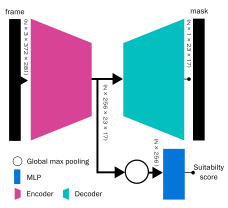

# muti-dn-fgr
## Multi-task Learning and Denoising Pretraining for Diagnosing Fetal Growth Restriction
This repository contains the implementation code for the `backbone` algorithm. 


### Dependencies
- PyTorch
- SimpleITK
- numpy >= 1.25.2
- pandas >= 2.0.3
- scikit-learn >= 1.2.2

## Trained models

## Run Locally
The following creates predictions for the mha files found in the input folder:
```commandline
python inference.py -i /input -o /output
```
### Main Arguments
- `--input-path'`, `'-i'` : location of the mha sweep data
- `'--output-path'`, `'-o'` : location of the mha binary segmentation mask and json of the optimal frame indexes
- `'--resource-path'`, `'-r'` : location of the trained UNet models

## Docker Submission
The following creates the Docker container (named backbone.tar.gz) including both the architecture and model weights
```commandline
./export.sh
```
